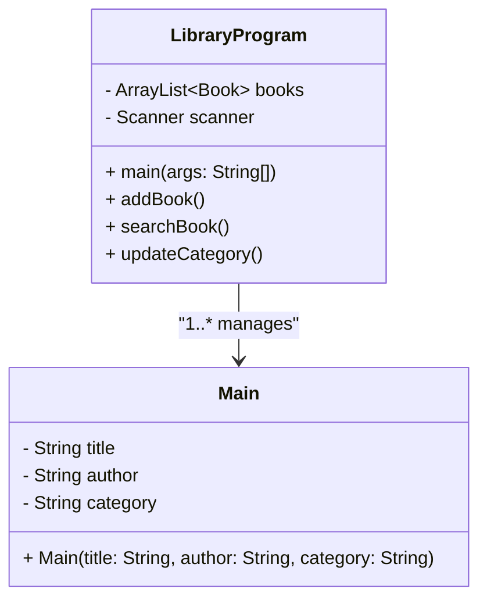
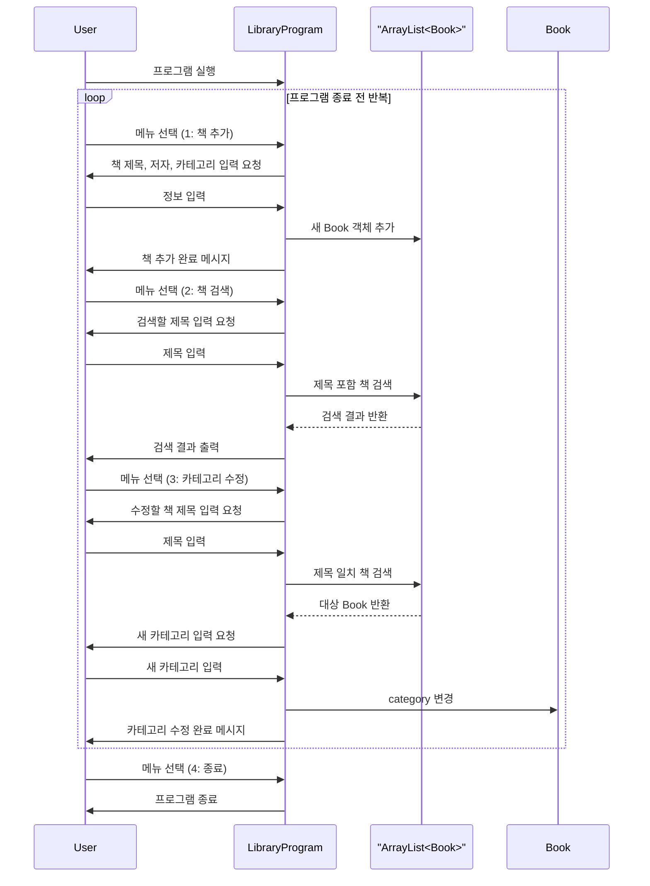

# 1. 개요

## 목적

- 도서의 **정보를 저장**하고 **검색**할 수 있으며, **직접 카테고리를 추가**할 수 있는 기능 개발

## 범위

- 도서 정보 저장 → 검색 → 결과 출력 + 카테고리 수정
    - [A] 도서 정보 저장
        - 도서 제목, 저자, 카테고리 저장
    - [B] 검색
        - 제목, 저자, 카테고리 중 하나를 선택하여 검색
    - [C] 결과
        - 도서 제목, 저자, 카테고리 출력
    - [+] 카테고리 수정
        - 도서의 카테고리를 수정

## 역할

|**역할**|**개발 기능**|**담당자**|**역할**|
|---|---|---|---|
|PM|기능 1개 (도서 정보 검색)|조하은|노션 작성|
|Coding&Testing|기능 2개 (도서 정보 저장, 카테고리 수정)|조은재|개발|
|Coding&Testing|기능 1개 (결과값 출력)|장연수|발표|

## 사용 기술

- 클래스와 객체
- Github
    - 이슈 : 이슈 관리
    - Branch 생성 : 코드 분리
    - Pull Request : 코드 머지
- JUnit : 단위테스트
- Notion : 문서 공유

## 기능 목록

- 정보 저장 기능
- 저장된 값을 입력하여 검색하는 기능
- 카테고리를 삭제, 수정, 추가하는 기능
- 저장된 도서의 제목, 저자, 카테고리를 출력하는 기능

# 2. 요구사항 정의서

- 위 기능들을 대상으로 요구사항을 작성한다.
- [x] [A] 도서 정보는 제목, 저자, 카테고리를 받는다.
- [x] [B] 도서 검색 및 출력은 사용자가 검색어(제목, 저자, 카테고리)를 입력하면 저장된 리스트에서 일치하는 도서 정보를 출력한다.
- [x] [C] 신규 도서 추가는 새로운 도서의 정보(제목, 저자, 카테고리)를 입력 받아 기존 도서 리스트에 추가한다.
- [x] [D] 저장된 도서 정보에서 카테고리 값을 수정하거나 추가한다.

# 3. 설계

## 3.1 협력, 역할, 책임 정의

### 3.1.1 협력 정의

- 사용자가 도서의 정보(제목, 저자, 카테고리)를 입력하여 추가한다.
- 사용자가 도서의 정보(제목, 저자, 카테고리)를 검색하여 특정 도서의 값을 불러온다.
- 사용자가 검색한 값과 일치하는 도서를 표시한다.
- 사용자가 도서의 카테고리 값을 변경한다.

### 3.1.2 역할 정의

- 도서 정보를 입력하고 저장
- 도서 정보의 리스트 중 사용자가 검색한 값과 일치하는 도서 정보를 표시
- 도서 정보 중 카테고리 값 수정

### 3.1.3 책임 정의

- 도서 정보를 저장할 책임
- 사용자가 검색한 값과 일치하는 도서 정보를 출력할 책임
- 도서의 카테고리를 수정하고, 이를 저장할 책임

## 3.2 클래스 설계(GPT, Mermaid 활용)

### 3.2.1 (구조 정의) 클래스 다이어그램



### 3.2.3 (절차 정의) 스퀀스 다이어그램



## 3.3 화면 정의(GPT 활용)

### 3.3.1 메인 화면

```jsx
[ 도서관 프로그램 ]
1. 책 추가
2. 책 검색
3. 카테고리 수정
4. 종료
메뉴 선택 :
```

### 3.3.2 서브 화면

1. 책 추가 선택 시

```jsx
[ 책 추가 ]
제목 : 초보탈출 손코딩 - 자바편
저자 : 홍길동
카테고리 : 컴퓨터 과학
```

1. 책 검색 선택 시

```jsx
[ 책 검색 ]
1. 제목
2. 저자
3. 카테고리
선택:
```

1. 카테고리 수정 선택 시

```jsx
[ 카테고리 수정 ]
수정할 책 제목: 초보탈출 손코딩 - 자바편
새 카테고리 입력: 005
```

1. 종료 선택 시

```jsx
프로그램 종료
```

## 3.4 단위테스트 케이스/결과서

- [ ] [1] 도서 정보 입력 테스트
    1. 대상 함수 : `bool saveBook(String title, Sting author, String category)`
        - 정상
            - 함수 입력 : "파이썬 입문", "김철수", 35000
            - 결과 : True
        - 오류1
            - 함수 입력 : "파이썬 입문", "김철수"
            - 결과 : False
        - 오류2
            - 함수 입력 : (누락), "김철수", 35000
            - 결과 : False
- [ ] [2] 도서 정보 검색 테스트
    1. 대상 함수 : `Book searchBook(String keyword)`
        - 정상
            - 함수 입력 :
            - 결과 :
        - 오류
            - 함수 입력 :
            - 결과 :
- [ ] [3] 카테고리 수정 테스트
    1. 대상 함수 : `bool updateCategory(String title, String newCategory)`
        - 정상
            - 함수 입력 :
            - 결과 :
        - 오류
            - 함수 입력 :
            - 결과 :

## 3.5 요구사항 정의서 점검

- [x] [A] 도서 정보는 제목, 저자, 카테고리만 받는다.
- [x] [B] 도서 검색 및 출력은 사용자가 도서의 정보(제목, 저자, 카테고리)를 입력하면 저장된 리스트에서 일치하는 도서 정보를 출력한다.
- [x] [C] 신규 도서 추가는 새로운 도서의 정보(제목, 저자, 카테고리)를 입력 받아 기존 도서 리스트에 추가할 수 있다.
- [x] [D] 저장된 도서 정보에서 카테고리 값을 수정하거나 추가할 수 있다.

# 4. 개발 및 테스트

## 4.1 [Github URL](https://github.com/choeunjae/Java-Library)

## 4.2 요구사항 추적(기능 개발 이후 표시)

- [x] [A] 도서 정보는 제목, 저자, 카테고리만 받는다.
    - [도서 정보 저장 · Issue #2 · choeunjae/Java-Library](https://github.com/choeunjae/Java-Library/issues/2)
- [x] [B] 도서 검색 및 출력은 사용자가 도서의 정보(제목, 저자, 카테고리)를 입력하면 저장된 리스트에서 일치하는 도서 정보를 출력한다.
    - [도서 검색 결과 출력 · Issue #5 · choeunjae/Java-Library](https://github.com/choeunjae/Java-Library/issues/5)
- [x] [C] 신규 도서 추가는 새로운 도서의 정보(제목, 저자, 카테고리)를 입력 받아 기존 도서 리스트에 추가할 수 있다.
    - [신규 도서 추가 · Issue #7 · choeunjae/Java-Library](https://github.com/choeunjae/Java-Library/issues/7)
- [x] [D] 저장된 도서 정보에서 카테고리 값을 수정하거나 추가할 수 있다.
    - [도서 카테고리 수정 · Issue #4 · choeunjae/Java-Library](https://github.com/choeunjae/Java-Library/issues/4)

# 5. 피드백

## 5.1 **달성하고자 하는 목표는?**

<aside> ✏️

작성요령

- 가능하다면 측정 가능한 목표를 작성한다.
    
- 프로젝트의 목표와 개인의 목표는 무엇이었나요?
    
- 우리가 설정했던 계획은 무엇이었나요? (일정, 역할, 기술 스택 등) </aside>
    
- 도서관 프로그램 개발
    
    - 도서 정보 저장, 검색, 카테고리 수정 기능

## 5.2 **달성한 목표는?**

<aside> ✏️

작성요령

- 측정한 목표에서 달성한 결과를 작성한다. </aside>
    
- 목표 기능 4개 중 4개 완료
    
    - [2. 요구사항 정의서](https://www.notion.so/2-2b06f28accaf80108e1fdc1237da8a82?pvs=21)

## 5.3 그 차이와 원인은?

<aside> ✏️

작성요령

- 목표를 달성했다면(는 달성하지 못했다면) 행동들을 분석해야 한다.
    
    - 분석을 통해 목표를 달성할 수 있었던(또는 달성에 실패한) 행동 패턴과 원리를 학습하는 것이 중요하다.
- 왜 그런 일이 일어났는가? 🤔
    
    - 어떤 행동 패턴이 목표를 달성하게 만들었는가?
    - 목표를 달성하지 못한 근본적인 행동 원인은 무엇인가?
    - 어느 점에서 차이가 발생했는가?
    - 실패 또는 어려움의 주요 원인은 무엇이었나요? 기술적인 문제였나요, 아니면 소통이나 협업의 문제였나요?
    - 개인적으로 어떤 부분이 부족했거나 개선이 필요하다고 느끼나요?
- 단, 달성하지 못한 원인은 외부에서 찾는 것은 의미가 없다. </aside>
    
- 요구사항을 중간 중간 점검하면서 개발했다.
    
- 체계적으로 개발을 진행했다.
    
    - 암묵지 → 형식지

## 5.4 앞으로 해야 할 일은?

<aside> ✏️

작성요령

- 이번 경험을 통해 배운 가장 중요한 교훈은 무엇인가요?
    
- 다음 프로젝트에서는 어떤 부분을 유지하고 어떤 부분을 개선해야 할까요? </aside>
    
- 교훈
    
    - 체계적인 개발 프로세스를 통한 SW 개발
    - 계획을 기획하면서 진행
    - 단위 테스트의 중요성을 배움
- 유지
    
    - 계획하면서 진행
    - 단위 테스트 진행
    - 체계적인 개발 프로세스 수행
- 개선
    
    - 해당사항 없음

## 5.5 앞으로 하지 말아야 할 일은?

<aside> ✏️

작성요령

- 이번 경험을 통해 배운 가장 중요한 교훈은 무엇인가요?
    
- 목표 달성에 방해가 되는 행동을 생각하고, 그 부분을 작성한다. </aside>
    
- 해당사항 없음
    

---

# Changelog

- v1.0
    - 개발 보고서 템플릿 정의
- v1.1
    - 개요 번호 명시
    - 메인화면 예시 작성
    - Github URL 추가